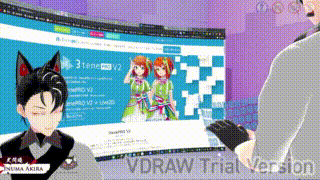

# 模型及動捕

🔵2D

✦2D皮套：由繪師創作立繪，拆分（包含臉部及各種會動的配件的分層），由模型師製作live2D檔案。

- live2D技術
    
    [https://forum.gamer.com.tw/Co.php?bsn=60608&sn=40198](https://forum.gamer.com.tw/Co.php?bsn=60608&sn=40198)
    
    [https://discord.com/invite/HVSFzfeede](https://discord.com/invite/HVSFzfeede)
    
    [https://www.cg-method.com/live2d-make-vtuber/](https://www.cg-method.com/live2d-make-vtuber/)
    
    L2D製作教程：[https://www.youtube.com/playlist?list=PL3sGye8NKCQ-DHy01xNkRLSKlzZ5VPL6z](https://www.youtube.com/playlist?list=PL3sGye8NKCQ-DHy01xNkRLSKlzZ5VPL6z)
    
    形狀編輯：[https://www.bilibili.com/video/BV1TX4y1T7HZ](https://www.bilibili.com/video/BV1TX4y1T7HZ)
    
    有部分面捕需要.exp3.json表情文件，用Live2D Cubism Editor編輯。
    
- 面部捕捉軟體
    - **VTube Studio**：目前最理想的L2D面捕方案。連接到有ARCore的安卓手機或有ARkit的蘋果設備可有更精準的面捕，且可有Z軸的檢測。（調節幅度很精細）
    另如果使用VBridger並加上iphoneX以上設備可檢測到吐舌、歪嘴等高級面捕。
        
        ✦優勢功能：綁掛件（靜態/動態）、快捷坐標移動、擴展移動（Movement Config）。
        
        ✦VTS使用：[https://bbs.nga.cn/read.php?tid=28374258&pid=547415017&rand=303](https://bbs.nga.cn/read.php?tid=28374258&pid=547415017&rand=303)
        
        ✦VTS使用：[https://bbs.nga.cn/read.php?tid=28374258&rand=415](https://bbs.nga.cn/read.php?tid=28374258&rand=415)
        
        ✦VTS基本及細微調試：[https://vip-jikkyo.net/vtube-studio-tutorial](https://vip-jikkyo.net/vtube-studio-tutorial)
        
        ✦VTS表情及細節調整：[https://www.bilibili.com/video/BV1WY411P7CT/](https://www.bilibili.com/video/BV1WY411P7CT/?spm_id_from=333.788)
        
        ✦VBridger：[https://www.bilibili.com/read/cv16108476](https://www.bilibili.com/read/cv16108476)
        儘管VBridger支持ARkit幾乎所有捕捉，且精準。但需要模型師做相關表情關聯，要不然捕捉到了模型也不會動。
        
    
    ~~✦facerig：目前應該還是使用最廣泛的面捕，但佔用高且精度低所以逐漸退燒。~~
    
    ~~✦Animaze：facerig的升級，需要用Animaze的話需要和模型師特別註明（需要通過Animaze Editor更新模型）。~~
    
    ~~✦HGFaceDD（未實測）：多人聯機為其特色。低系統佔用。~~
    
    ~~✦prprlive（未實測）：佔用低，有自己的生態。~~
    
    ✦Live2DViewerEX：L2d的展示軟件，可透明推流，主要是用在動畫上。非實時面捕軟件。
    
    ✦各面捕操作：[https://bbs.nga.cn/read.php?tid=26267348&rand=914](https://bbs.nga.cn/read.php?tid=26267348&rand=914)
    

---

🔵3D

✦3D模型：VRoid Studio可直接製作綁好動作的.vrm檔。接著可導入Blender或Unity中修改。

- 3D模型製作：
    
    ✦其他專業建模軟件（Blender、Unity、虛幻）參考：
    
    - VRoid Studio相關
        
        ✦VRoid可做大部分的身體、頭髮、服裝建模。但除了頭髮以外都必須使用內建的模型做調整。若沒有特殊衣服、配件、尾巴等要求的話，用內附的即可。衣服可取部分使用、組合。
        
        ✦BOOTH上面有不少衣服販賣，可參考：[https://booth.pm/ja/browse/VRoid?page=14](https://booth.pm/ja/browse/VRoid?page=14)
        
        ✦Vroid分享：[https://hub.vroid.com/](https://hub.vroid.com/)
        
        ✦頭部的配件可用頭髮來調整，頭髮會隨頭部骨骼移動，故耳朵、帽子、眼鏡等其他頭部配件都可以製作。
        [https://www.bilibili.com/video/BV13a411Y7Tx/?spm_id_from=333.788](https://www.bilibili.com/video/BV13a411Y7Tx/?spm_id_from=333.788)
        
        ✦非頭部的配件（身上的飄帶、非制式的衣服形態）先使用頭髮將形狀和位置拉好之後，再導入Unity中將骨骼綁定到身上或手上。（需要先裝UniVRM插件Unity才能讀取vrm）
        [https://github.com/vrm-c/UniVRM/](https://github.com/vrm-c/UniVRM/)
        
        ✦為了方便加載對照圖、參考線、實時更新材質圖等應使用插件VRoidXYTool。需先在根目錄裝BepInEx，然後在其下的plugins文件夾放入插件的dll。
        [https://github.com/BepInEx/BepInEx](https://github.com/BepInEx/BepInEx)
        [https://github.com/xiaoye97/VRoidXYTool](https://github.com/xiaoye97/VRoidXYTool)
        
    - Unity從Vroid導入修改
        
        1.需要UniVRM才能讀取VRM檔。[https://github.com/vrm-c/UniVRM/releases](https://github.com/vrm-c/UniVRM/releases)
        
        2.要改變VRM中骨骼的綁定需要Unity_BoneWeightTransfer。 [https://booth.pm/ja/items/1784758](https://booth.pm/ja/items/1784758)
        3.要增加表情blendshape的話需要HANA Tool。 [https://kuniyan.booth.pm/items/2437978](https://kuniyan.booth.pm/items/2437978) （先用Reader創建不同的表情調整參數，再用ClipBuilder創建表情）關於52種表情：[https://hinzka.hatenablog.com/entry/2020/10/12/014540](https://hinzka.hatenablog.com/entry/2020/10/12/014540)
        
        [model-motion-capture-example.mp4](model-motion-capture-example.mp4)
        
        4.詳細[https://www.bilibili.com/video/BV1up4y1S71w?p=1](https://www.bilibili.com/video/BV1up4y1S71w?p=1)
        
        5.透明衣服、發光配件 [https://www.bilibili.com/video/BV1vY4y1k7fU/?spm_id_from=333.788](https://www.bilibili.com/video/BV1vY4y1k7fU/?spm_id_from=333.788)
        
- 動作捕捉軟體：
    - 通過VMC通道
        
        ✦**VSeeFace**：本身的面捕還可以，有虛擬攝像機輸出。調整內容非常細緻。最強的是可以通過VMC輸入輸出（且可分只讀取部分身體部件的動作），面捕則可搭配iFacialMocap/FaceMocap3D/VTS來讀取蘋果的ARKit（辨識方式用的是表情Clip）。手補也可用Leap Motion。
        
        ✦**ThreeDPoseTracker**：沒有面捕、可手補、半身動捕、全身動捕。來源除了cam外可以通過影片。可錄製BVH/VMD動作檔，也可以用VMC通道實時輸出、輸入。 [https://qiita.com/yukihiko_a/items/d5c9635e4f1d7f69451f](https://qiita.com/yukihiko_a/items/d5c9635e4f1d7f69451f)
        
        ✦**Virtual Motion Capture** [https://vmc.info/](https://vmc.info/) 本身可用作VR遊戲的動捕，靠SteamVR加載。可通過插件實時到虛幻、Unity、Blender。
        
         ✦LIV：將人物顯示在VR遊戲畫面中的指定位置。 [https://www.liv.tv/](https://www.liv.tv/)
        
        ✦MocapForAll：10,000可先試用。用多台webcam達到較精準位置的全身動捕。[https://vrlab.akiya-souken.co.jp/product](https://vrlab.akiya-souken.co.jp/product)
        
    
    ✦**VDRAW**：可以把電腦作業中操作（繪圖、遊戲、打字）轉變成3D人物的動作。只有電腦動作輸入無面捕。（用鍵盤顯示時記得打開random以免按鍵被觀眾看到。）
    
    
    
    ✦**VARK SHORT**：直接用VRM模型生成小動畫。 [https://lp.vark.co.jp/varkshorts/](https://lp.vark.co.jp/varkshorts/)
    
    - **~~VUP**：3D動捕的強者，但版權規則較討厭（模型可供VUP做廣告用、可複製等）。可以輕鬆使用表情、動作（動態）、姿勢（靜態），模型表現也最好。有很多預設動作。
    一般設備的話可使用面捕（無需蘋果手機可辨識ARKit默認的blendshape，且無需表情Clip，只需要有52BS的表情調整條即可），但通過其他配件，Leap Motion可做手捕（推薦用掛脖式的比較容易捕捉到）；Kinect V2及Intel Realsense可做全身動捕（需配合Nuitrack）。可以接收VMC的動捕訊號。~~
        
        ~~✦VUP詳細設定：[https://virtualup.cn/document](https://virtualup.cn/document)
        ✦支持.vmd，.fbx動作檔（需在Unity裡面先更新）。
        ✦可以編輯面捕通道。~~
        
    
    ~~✦小K直播姬：無需其他設備即可使用半身捕，強悍。細部設定仍不完全所以對模型的表現有些影響。（在Vroid導出的時候要取消掉“”的勾選）主要問題是升級不太穩定（有些版本秒退）。
    表面太油的話可在Vroid裡面選臉部或身體貼圖>貼圖編輯>顏色校準>將Shader顏色的兩個勾取消掉。~~
    
    ~~✦3tene：基本可對標VUP，版權無問題。但動作表情姿勢等比較少。同樣支持Leap Motion、Kinect、Intel Realsense等，最完全版可支持Perception Neuron（全身裝載動捕）。基本面捕若用有TrueDepth的iphone的話可更精準。無法用VMC。~~
    
    ~~✦Animaze：應該是西方主要使用的3D動捕，可用leap motion捕捉手勢但是在模型上的反應不是很好。~~
    
    ~~✦Kalidoface 3D：可直接在瀏覽器上做只靠webcam的全身動捕。（延遲比較大。但本身是開源java若有技術力可自己開發）。~~
    
    ~~✦Webcam Motion Capture：[https://webcammotioncapture.info/ja/#download](https://webcammotioncapture.info/ja/#download) 買斷6980円。可用webcam手補。只能出綠幕屏。~~
    
    ~~✦wakaru：一般的面捕，未深究。~~
    
    ~~✦RiBLA：一般面捕，未深究。~~
    
    ~~✦waidayo：手機聯動電腦的面捕，可用部分bladeshape（ARKit）但無法全部。[https://github.com/nmchan/waidayo](https://github.com/nmchan/waidayo)~~
    
    ~~✦SysMocap：某大佬的大學畢業作，還在開發中（目前無法選擇相機）。可用webcam全身動捕。[https://github.com/xianfei/SysMocap/releases](https://github.com/xianfei/SysMocap/releases)~~
    
    ✦虛擬攝影棚：[https://virtualcast.jp/](https://virtualcast.jp/)
    
    ✦需要多台捕捉的時候可將手機變成webcam：[https://www.elgato.com/ja/epoccam](https://www.elgato.com/ja/epoccam)